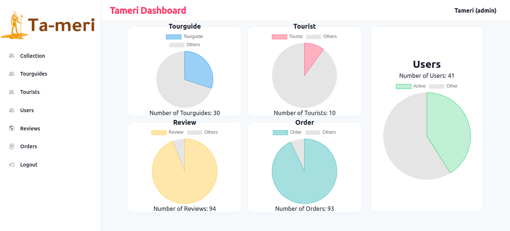
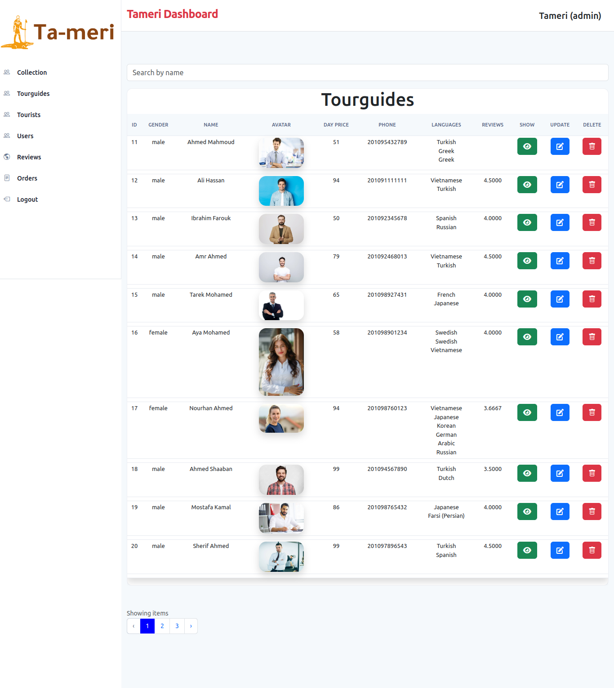
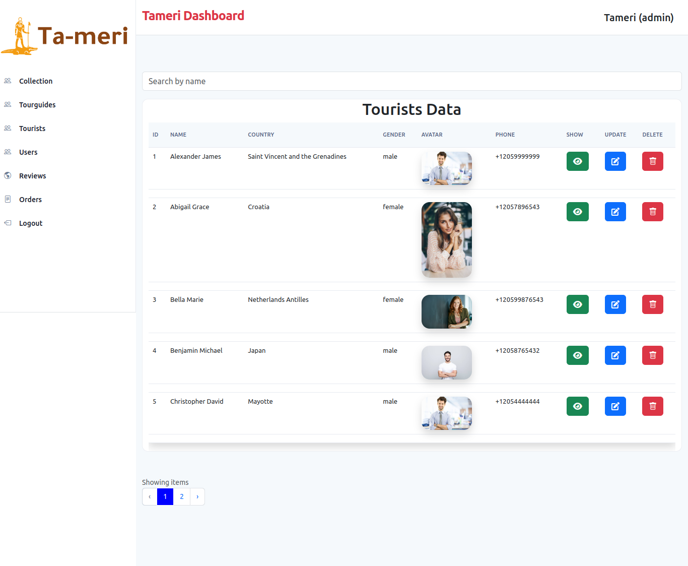
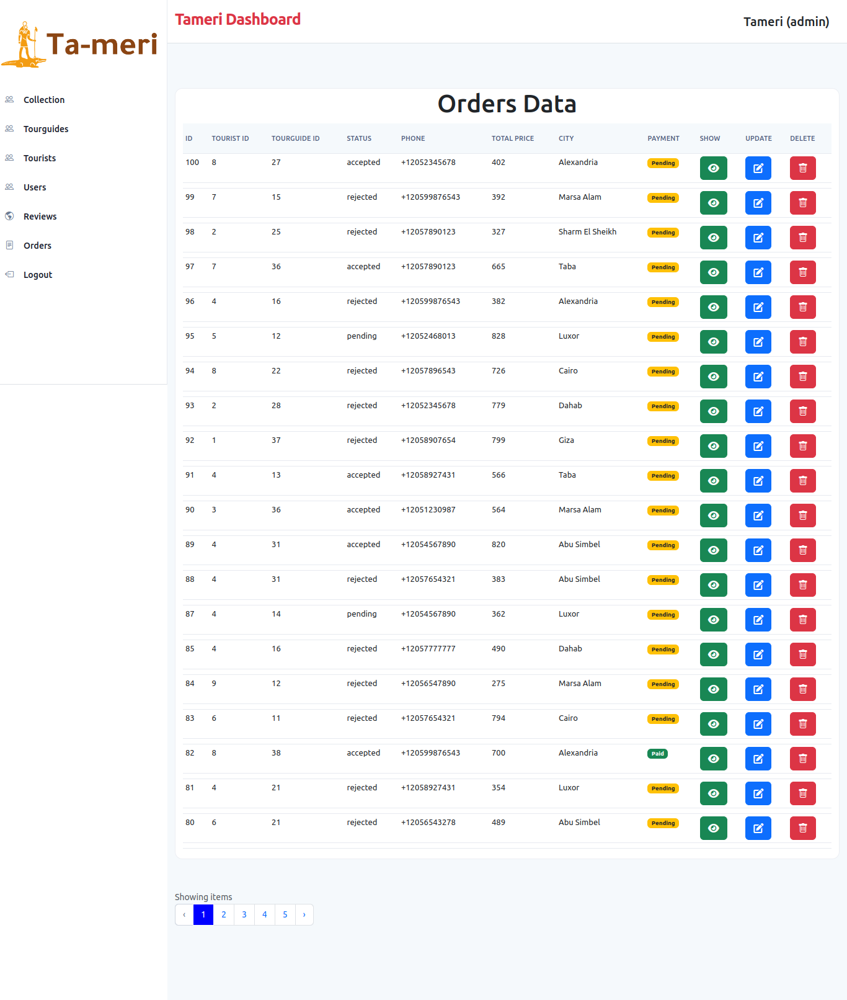
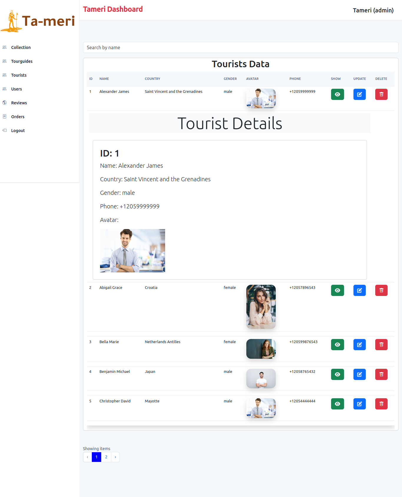
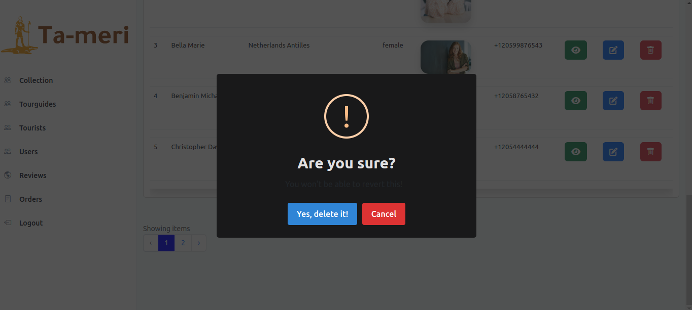

# Tameri Backend Project

## Overview

Welcome to the Tameri Backend Project! This Laravel and Bootstrap-based project serves as the backend infrastructure for the Tameri application, providing essential features for seamless operation.

## Team Members
- [Ahmed Shaaban Ahmed](https://github.com/ahmedshaaban1608)
- [Dina Emad Noureldin](https://github.com/dinaemad88)
- [Rawan Ramadan Ismail](https://github.com/rawanramadan22)
- [Rwda Emad eldeen](https://github.com/rwda)
- [Hamza Mahmoud Omar](https://github.com/hamza-halawa2020)


## Frontend (Angular)
The frontend is implemented using the angular framework.
- [Tameri Frontend Repo](https://github.com/ahmedshaaban1608/Ta-meri)

## Features

### Payment Gateway

The project includes a secure and reliable payment gateway for facilitating transactions within the Tameri application.

### Dashboard View (Admin Panel)

Admins can access a comprehensive dashboard view, providing insights and control over the system. Key metrics, user management, and various features are accessible through the admin panel.

### Controllers

- **HomeController**: Manages the main functionality and routes related to the home page.
- **AreaController**: Handles operations related to geographic areas.
- **OrderController**: Manages order processing, tracking, and related operations.
- **LanguageController**: Manages language-related functionalities.
- **ReviewController**: Handles user reviews and feedback.
- **ReportController**: Manages reporting functionality.
- **TourGuideController**: Manages tour guides and related operations.
- **TouristController**: Handles tourist-related functionalities.

### Resources

Dedicated resource classes support each controller, ensuring clean and organized code structure for data transformation and formatting.

### Requests

Request classes validate incoming data, ensuring accurate and secure information for the application.

### Mail Services

The project incorporates mail services to handle email notifications and communication between users.

### Guard, Authorization, and Authentication

Security is a top priority with guards for user roles, robust authorization mechanisms, and a well-implemented authentication system.

## Getting Started

1. **Clone the repository.**
    ```bash
    git clone https://github.com/ahmedshaaban1608/tameri-backend
    ```

2. **Install dependencies.**
    ```bash
    composer install
    ```
3. **Install Dependencies**
    ```bash
    npm install
    ```
4. **Set up environment variables.**
    - Configure database settings and API keys for external services in the `.env` file.

5. **Run database migrations.**
    ```bash
    php artisan migrate
    ```

6. **Start the development server.**
    ```bash
    php artisan serve
    ```

Explore the codebase, and refer to the documentation or contact maintainers for questions or issues.

##
## Project gallery
- Homepage


- Tourguides list


- Tourists list


- Orders


- Show user


- Delete action


##
Feel free to explore our project and contribute to making Egypt's tourism experiences memorable for everyone!
